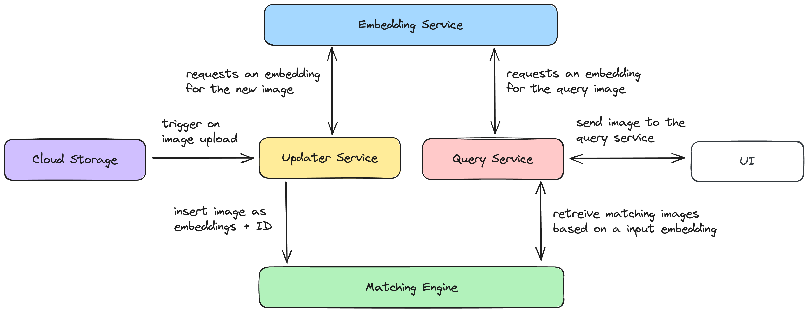

# Image Similarity Search

## Architecture

The architecture can scale to any number of requests and is built on top of 

* Cloud Run 
* Vertex AI Gemini
* Vertex AI Vector Search (previously named Matching Engine)
* Cloud Eventarc
* Cloud Storage



## Setup

### Enabled APIs

````
gcloud services enable \
    run.googleapis.com \
    eventarc.googleapis.com \
    storage.googleapis.com \
    cloudbuild.googleapis.com \
    aiplatform.googleapis.com
````

## create bucket and upload initial embeddings
````
gsutil mb -l us-central1 gs://$BUCKET_NAME
gsutil cp setup/initial_embeddings.json gs://$BUCKET_NAME/contents/
````

### Create a bucket and upload a dummy file 
(Vector search requires at lest one embedding during index creation. After that we add new images via streaming in real time). 

### Setup Index

The index requires metadata.json containing the index configuration. 
You can find a sample one in the setup folder.
````
gcloud ai indexes create \
  --region=$REGION \
  --display-name="image-similarity-index" \
  --description="Index for image similarity" \
  --metadata-file="index_metadata.json" \
  --index-update-method="stream_update"
````

After the index is created we need an index endpoint.
````
gcloud ai index-endpoints create \
  --region=$REGION \
  --display-name="$image-similarity-index-endpoint"   
````

As next step we depoy the index to the index endpoint
````
gcloud ai index-endpoints deploy-index \
  --region=$REGION \
  --display-name="deployed-index" \
  --index=$INDEX_ID \
  --index-endpoint=$INDEX_ENDPOINT_ID
````

If you want to learn more about Vector Search check out more details https://medium.com/google-cloud/all-you-need-to-know-about-google-vertex-ai-matching-engine-3344e85ad565

## Deploy Updater and Query Service

The updater and query Cloud Run services can be deployed automatically using Cloud Build. 
The two folder contain a cloudbuild.yaml.
The deployer and query service have enviornment variables make sure to adapt them to your project.
**Will consider terraform for future versions of this POC**

````
gcloud builds submit --config cloudbuild.yaml
````

### Setup Eventarc

````
gcloud eventarc triggers create image-similarity-updater-trigger \
  --location=$REGION \
  --destination-run-service=$CLOUD_RUN_SERVICE_NAME \
  --destination-run-region=$REGION \
  --event-filters="type=google.cloud.storage.object.v1.finalized" \
  --event-filters="bucket=$BUCKET_NAME" \
  --service-account=$EVENTARC_SERVICE_ACCOUNT
````

## Usage

### Add new images to Vector Search
To add new images to the vector simply upload them to the bucket that is defined in the updater service. 

### Query
To query similar images you can use the API endpoint. 

Sample code:

```python
import requests
import base64

# Function to encode an image file to base64
def encode_image_to_base64(image_path):
    with open(image_path, "rb") as image_file:
        encoded_string = base64.b64encode(image_file.read()).decode('utf-8')
    return encoded_string

# Define the API endpoint
api_url = "http://0.0.0.0:8000/query"

# Path to the image you want to send
image_path = "/Users/sascha/Desktop/development/image-similarity-search/query-service/4018065.jpeg"

# Encode the image
encoded_image = encode_image_to_base64(image_path)

# Create the payload
payload = {
    "image": encoded_image,
    "threshold": 0.7  # Optional, you can set a different value if needed
}

# Set the headers
headers = {
    "Content-Type": "application/json"
}

# Make the POST request
response = requests.post(api_url, json=payload, headers=headers)

# Print the response
if response.status_code == 200:
    print("Response from API:")
    print(response.json())
else:
    print(f"Failed to get a response. Status code: {response.status_code}")
    print(response.text)

````

## Possible Optimization
* **DONE** ~~Use Google Cloud Vertex AI Image Embedding API instead of the custom build embedding model hosted on Vertex AI~~
* Add terraform for easy 2 min setup, instead of running multiple gcloud commands.